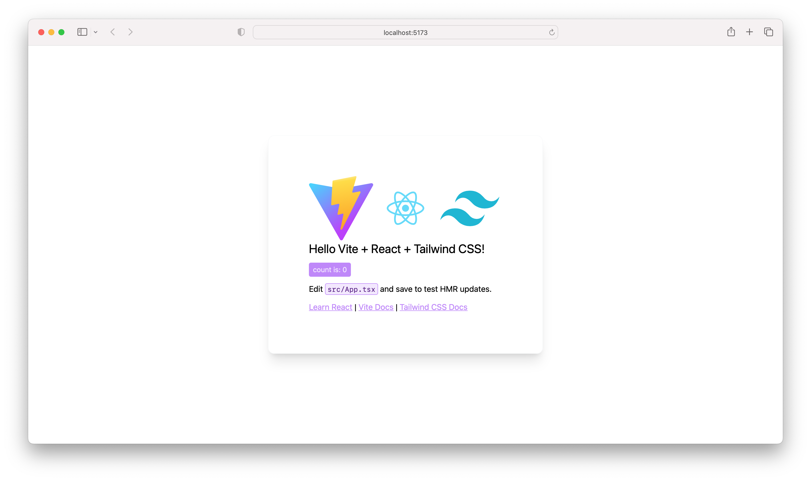
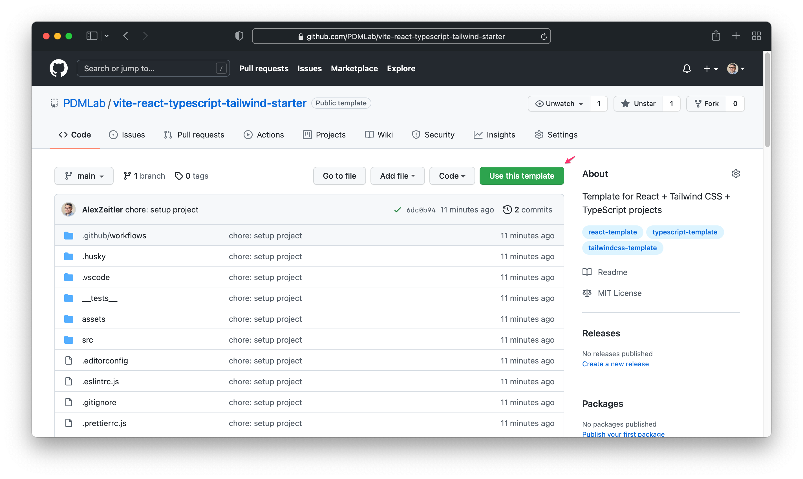

# vite React TypeScript tailwindcss starter

Template for vite, React + tailwindcss + TypeScript projects with some tools preconfigured.

## About

Template for vite, React + tailwindcss + TypeScript projects with some tools preconfigured.



### Libraries

- [Jest](https://jestjs.io/)
- [React](https://reactjs.org/)
- [tailwindcss](https://tailwindcss.com/)
  - [tailwindcss forms plugin](https://tailwindcss-forms.vercel.app/)
- [TypeScript](https://www.typescriptlang.org/)
- [vite](https://vitejs.dev/)

### Tools

- [commitlint](https://commitlint.js.org)
- [Conventional Commits](https://www.conventionalcommits.org)
- [editorconfig](https://editorconfig.org/)
- [eslint](https://eslint.org/)
- [husky](https://typicode.github.io/husky/#/)
- [Prettier](https://prettier.io/)
- [VS Code settings](https://code.visualstudio.com/)

## Usage

Create a new project from this template by clicking the "Use this template" button:



```bash
yarn
yarn dev
yarn test
```
